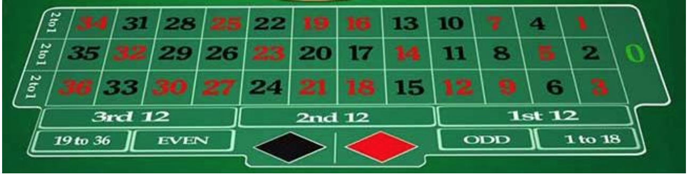

Esercizio Roulette

---

Realizzare di una Roulette funzionante da riga di comando.
Il programma dovrà consentire all'utente di effettuare una giocata a scelta, fornendogli l'esito
della partita e la relativa eventuale vincita in fiches (1 fiche = 1 €). Basandosi sull'immagine seguente, abilitare almeno le seguenti opzioni di gioco:

- puntata sui numeri neri o rossi (si vince il doppio della puntata),
- puntata sui numeri pari o dispari (si vince il doppio della puntata),
- puntata su un numero secco (si vince 36 volte la puntata).

L'applicazione avrà una classe Giocatore, incapsulata, ove saranno salvati nome e fiches disponibili. Esclusivamente a inizio partita il giocatore dovrà scegliere quanto contante "cambiare" in fiches e non potrà ripetere l'operazione.
Il giocatore non potrà puntare più di quante fiches possiede: se ne ha 10, puntandone 20, un messaggio lo avvertirà che la sua puntata è stata modificata alla sua disponibilità massima (10 fiches).
In caso di vittoria (rispettivamente di sconfitta) il giocatore sarà aggiornato delle fiches vinte (perse) e del nuovo totale a sua disposizione; dopo ogni giocata, a meno dell'esaurimento delle proprie fiches, il giocatore potrà scegliere se continuare o ritirarsi, ricevendo in questo caso un messaggio riassuntivo delle fiches in suo possesso che potrà cambiare in contate alla cassa. Lo 0 (zero) è un esito possibile della roulette, ma il giocatore non può sceglierlo poiché è riservato al "banco": se esce 0 il giocatore perde sempre.
Andranno gestite le eccezioni causate da input errati dell'utente, invitando il giocatore e reinserire il dato richiesto.
Il programmatore implementerà l'applicazione sfruttando in piena libertà costrutti e
metodologie trattati durante il corso, oltre a eventuali classi e package disponibili nelle API di Java, se lo riterrà necessario.
